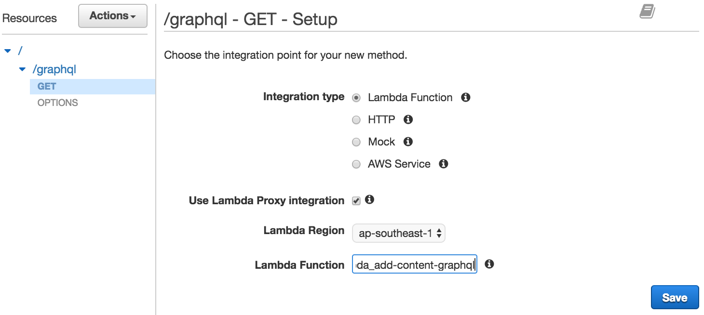
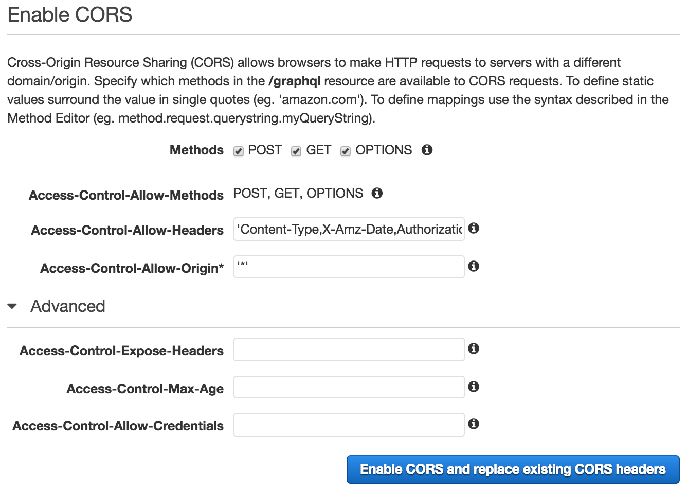

# ADD content GraphQL server

## Settings

Environemnt Variable | Description
--- | ---
`ENABLE_GRAPHIQL` | enable GraphiQL UI (standalone or docker only)
`MAX_NUM_CATEGORY_ARTICLE` | maximum number of article to fetch from NEWS and CMS API
`CORS_ORIGIN` | allowed origin to fetch the data, comma separated, e.g. http://example.com,https://example.com
`IMG_URL_PREFIX` | prefix the image URL if no origin specified, e.g. http://210.242.234.173
`APICACHE_REDIS_HOST` | redis cache host name
`APICACHE_REDIS_PORT` | redis cache port, default 6379
`INSTAGRAM_ENDPOINT` | instagram endpoint
`HOME_LATEST_ENDPOINT` | home page latest API endpoint
`HOME_FASHION_ENDPOINT` | home page fashion API endpoint
`HOME_BEAUTY_ENDPOINT` | home page beauty API endpoint
`HOME_LUXE_ENDPOINT` | home page luxe API endpoint
`HOME_WEDDING_ENDPOINT` | home page wedding API endpoint
`HOME_CELEBRITY_ENDPOINT` | home page celebrity API endpoint
`HOME_LIFESTYLE_ENDPOINT` | home page lifestyle API endpoint
`HOME_HIGHLIGHT_ENDPOINT` | home page highlight API endpoint
`HOME_EDITOR_PICK_ENDPOINT` | home page editor pick API endpoint
`NEWS_ARTICLE_ENDPOINT` | news API endpoint
`MENU_ENDPOINT` | menu API endpoint
`MPM_ENDPOINT` | MPM API endpoint
`EDITOR_PICK_LIST_ENDPOINT` | list editor pick API endpoint
`BANNER_ENDPOINT` | banner API endpoint
`UPCOMING_EVENT_ENDPOINT` | upcoming event API endpoint
`POST_EVENT_ENDPOINT` | post event API endpoint
`CONTRIBUTOR_ENDPOINT` | list contributor API endpoint
`CONTRIBUTOR_ARTICLE_ENDPOINT` | list contributor article API endpoint
`ADVERTORIAL_FASHION_ENDPOINT` | fashion advertorial API endpoint
`ADVERTORIAL_BEAUTY_ENDPOINT` | beauty advertorial API endpoint
`ADVERTORIAL_LUXE_ENDPOINT` | luxe advertorial API endpoint
`ADVERTORIAL_WEDDING_ENDPOINT` | wedding advertorial API endpoint
`ADVERTORIAL_CELEBRITY_ENDPOINT` | celebrity advertorial API endpoint
`ADVERTORIAL_LIFESTYLE_ENDPOINT` | lifestyle advertorial API endpoint
`CAMPAIGN_ENDPOINT` | campaign API endpoint
`CMS_FASHION_ENDPOINT` | fashion CMS API endpoint
`CMS_BEAUTY_ENDPOINT` | beauty CMS API endpoint
`CMS_LUXE_ENDPOINT` | luxe CMS API endpoint
`CMS_WEDDING_ENDPOINT` | wedding CMS API endpoint
`CMS_CELEBRITY_ENDPOINT` | celebrity CMS API endpoint
`CMS_LIFESTYLE_ENDPOINT` | lifestyle CMS API endpoint
`CMS_ARTICLE_DETAIL_ENDPOINT` | CMS article detail API endpoint


## Run in AWS Lambda

### Step 0. Install dependencies

Dependencies should be installed before deployment.
Please use `npm` to install the dependencies.

```shell
npm install
```

There are two ways to run the server, standalone or AWS Lambda with API Gateway.

### Step 1. Deploy AWS Lambda

The server for AWS Lambda is exported at `index.handle` in `index.js`.

#### Using [Apex](http://apex.run)

To initialize AWS Lambda environment, run `apex init` to let apex help you to
setup the IAM Roles and AWS Lambda Functions environment.

Update the environment settings in `function.json`

To deploy, run the command `apex deploy add-content-graphql` to deploy it.

#### Upload manually

Zip this directory and upload to AWS by Web Console, `aws-cli` or deployment
tool.


### Step 2. Setup ElastiCache Redis

To serve data with cache, an ElastiCache Redis is required. To use ElastiCache
in Lambda, a VPC configuration is needed. Here is a [guideline](VPC.md).

After configure the VPC, update the `function.json` vpc section for
corresponding settings, or configure the VPC section in AWS Console:


Set the `APICACHE_REDIS_HOST` and `APICACHE_REDIS_PORT` to the ElastiCache Redis.

You should attach `AWSLambdaVPCAccessExecutionRole` policy to the lambda role too.

### Step 3. Setup AWS API Gateway

After deploy the Lambda function, config API Gateway in AWS Console.

1. Create new API, give a name e.g. `addv2API`

2. Add new resource, name it `graphql` at path `/graphql`
, select *Enable API Gateway CORS*

3. Create `GET` and `POST` methods for `/graphql` with same settings

    - Integration Type: *Lambda Function*
    - Select *Use Lambda Proxy integration*
    - Select your *Lambda Region* and *Lambda Function*
4. Enable CORS for `/graphql`

    - Access-Control-Allow-Origin: `'*'`
5. Deploy the API to stage


## Run as Standalone Server

Instead of AWS Lambda, you could run the GraphQL server as a the standalone
server by the command `bin/server`.

To configure the server, set environment variables. Here is an example of exports:

```shell
export ENABLE_GRAPHIQL=1
export CORS_ORIGIN=http://localhost:3000
export MAX_NUM_CATEGORY_ARTICLE=200
export IMG_URL_PREFIX=http://210.242.234.173
export APICACHE_REDIS_HOST=localhost
export APICACHE_REDIS_PORT=6379
export INSTAGRAM_ENDPOINT=https://www.instagram.com/appledailydeluxe/media/
export HOME_LATEST_ENDPOINT=http://qa.nextmag.com.tw:8080/cmsapi/componefeed/43/HomeGallery_224.dat
export HOME_FASHION_ENDPOINT=http://qa.nextmag.com.tw:8080/cmsapi/componefeed/43/HomeGallery_226.dat
export HOME_BEAUTY_ENDPOINT=http://qa.nextmag.com.tw:8080/cmsapi/componefeed/43/HomeGallery_227.dat
export HOME_LUXE_ENDPOINT=http://qa.nextmag.com.tw:8080/cmsapi/componefeed/43/HomeGallery_228.dat
export HOME_WEDDING_ENDPOINT=http://qa.nextmag.com.tw:8080/cmsapi/componefeed/43/HomeGallery_273.dat
export HOME_CELEBRITY_ENDPOINT=http://qa.nextmag.com.tw:8080/cmsapi/componefeed/43/HomeGallery_229.dat
export HOME_LIFESTYLE_ENDPOINT=http://qa.nextmag.com.tw:8080/cmsapi/componefeed/43/HomeGallery_230.dat
export HOME_HIGHLIGHT_ENDPOINT=http://qa.nextmag.com.tw:8080/cmsapi/componefeed/43/HomeGallery_249.dat
export HOME_EDITOR_PICK_ENDPOINT=http://qa.nextmag.com.tw:8080/cmsapi/getfeed/34/recommend/183
export NEWS_ARTICLE_ENDPOINT=http://mldev.api.appledaily.com.hk/v1/1
export MENU_ENDPOINT=http://qa.nextmag.com.tw:8080/cmsapi/getfeed/34/cat
export MPM_ENDPOINT=http://qa.nextmag.com.tw:8080/cmsapi/componefeed/43/HomeGallery_223.dat
export EDITOR_PICK_LIST_ENDPOINT=http://qa.nextmag.com.tw:8080/mongoapi/articlelist/34/183
export BANNER_ENDPOINT=http://qa.nextmag.com.tw:8080/cmsapi/componefeed/43/HomeGallery_250.dat
export UPCOMING_EVENT_ENDPOINT=http://qa.nextmag.com.tw:8080/cmsapi/componefeed/43/HomeGallery_253.dat
export POST_EVENT_ENDPOINT=http://qa.nextmag.com.tw:8080/mongoapi/articlelist/34/185
export CONTRIBUTOR_ENDPOINT=http://qa.nextmag.com.tw:8080/cmsapi/componefeed/43/HomeGallery_251.dat
export CONTRIBUTOR_ARTICLE_ENDPOINT=http://qa.nextmag.com.tw:8080/mongoapi/articlelist/34/191
export ADVERTORIAL_FASHION_ENDPOINT=http://qa.nextmag.com.tw:8080/cmsapi/componefeed/43/HomeGallery_225.dat
export ADVERTORIAL_BEAUTY_ENDPOINT=http://qa.nextmag.com.tw:8080/cmsapi/componefeed/43/HomeGallery_232.dat
export ADVERTORIAL_LUXE_ENDPOINT=http://qa.nextmag.com.tw:8080/cmsapi/componefeed/43/HomeGallery_239.dat
export ADVERTORIAL_WEDDING_ENDPOINT=http://qa.nextmag.com.tw:8080/cmsapi/componefeed/43/HomeGallery_272.dat
export ADVERTORIAL_CELEBRITY_ENDPOINT=http://qa.nextmag.com.tw:8080/cmsapi/componefeed/43/HomeGallery_243.dat
export ADVERTORIAL_LIFESTYLE_ENDPOINT=http://qa.nextmag.com.tw:8080/cmsapi/componefeed/43/HomeGallery_247.dat
export CAMPAIGN_ENDPOINT=http://qa.nextmag.com.tw:8080/cmsapi/componefeed/43/HomeGallery_252.dat
export CMS_FASHION_ENDPOINT=http://qa.nextmag.com.tw:8080/mongoapi/articlelist/34/178
export CMS_BEAUTY_ENDPOINT=http://qa.nextmag.com.tw:8080/mongoapi/articlelist/34/179
export CMS_LUXE_ENDPOINT=http://qa.nextmag.com.tw:8080/mongoapi/articlelist/34/180
export CMS_WEDDING_ENDPOINT=http://qa.nextmag.com.tw:8080/mongoapi/articlelist/34/222
export CMS_CELEBRITY_ENDPOINT=http://qa.nextmag.com.tw:8080/mongoapi/articlelist/34/181
export CMS_LIFESTYLE_ENDPOINT=http://qa.nextmag.com.tw:8080/mongoapi/articlelist/34/182
export CMS_ARTICLE_DETAIL_ENDPOINT=http://qa.nextmag.com.tw:8080/cmsapi/getfeed/34/article
```

## Run in Docker

Docker image could be built by `docker build` command

To run the docker image, provide the config through environment variables and
expose the port 4000 in `docker run` command. To use cache, the redis server
should be reachable from this container.
